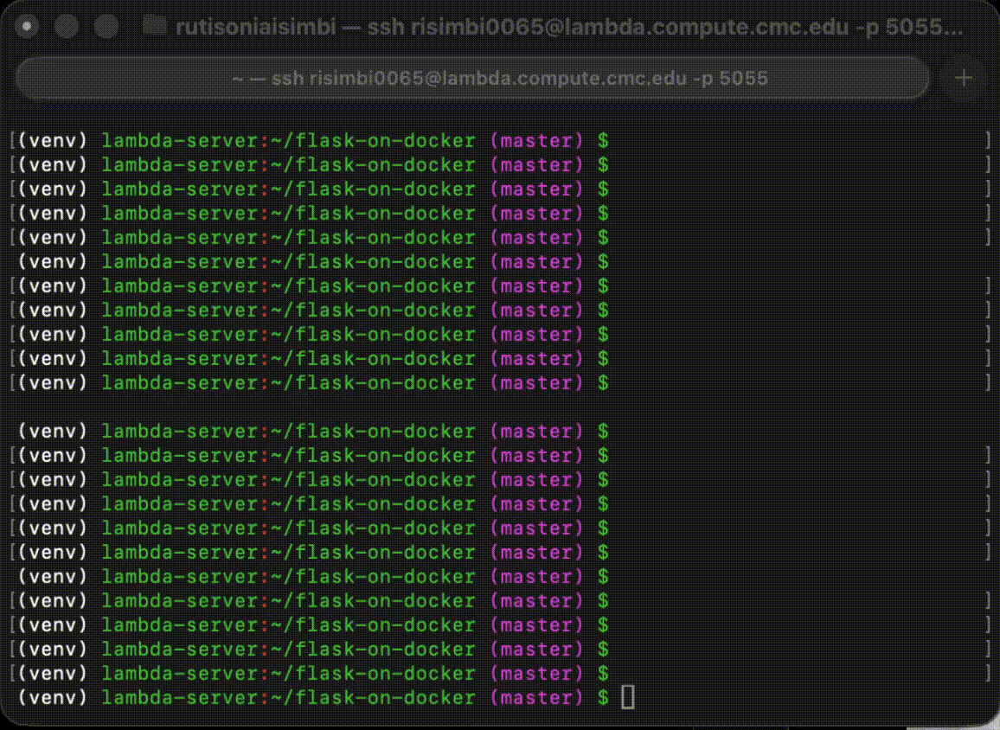

# flask_on_docker


## Overview
This repository demonstrates a Dockerized Flask web application backed by PostgreSQL, served with Gunicorn as the WSGI server and Nginx as a reverse proxy. The app supports image uploads and retrieval via a REST API, mirroring a simplified version of the Instagram tech stack. In development, Flask's built-in server is used; in production, Gunicorn and Nginx handle requests with static/media files served efficiently through a shared Docker volume.

## Demo


## Build Instructions

### Development
```bash
docker compose up -d --build
curl http://localhost:5100
```

### Production
```bash
docker compose -f docker-compose.prod.yml up -d --build
curl http://localhost:5101

# Upload a file
curl -X POST http://localhost:5101/upload -F "file=@/path/to/image.jpg"

# View uploaded file
curl http://localhost:5101/media/image.jpg
```
